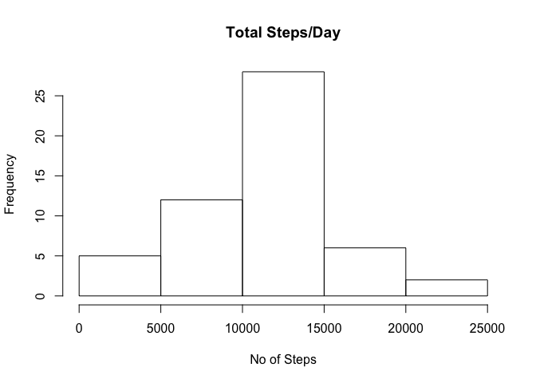
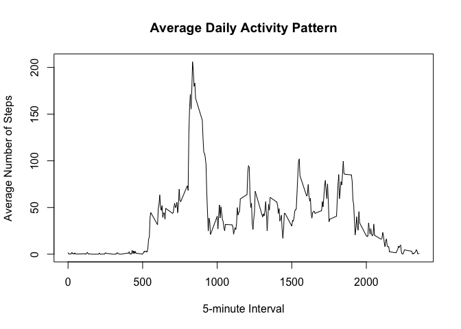
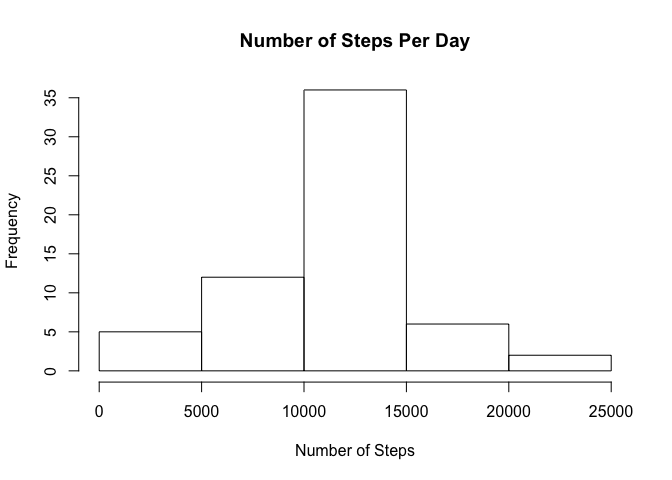
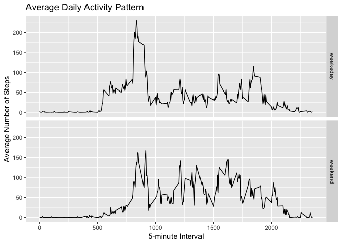

Downloading Data

```r
if (!file.exists('activity.csv')) 
  {
  unzip(zipfile = "activity.zip")
  }
activityData <- read.csv(file="activity.csv", header=TRUE)
```

#What is mean total number of steps taken per day?
(ignore the missing values in the dataset)

##Calculate the total steps taken everyday 

```r
totalsteps<-aggregate(steps ~ date, activityData, FUN=sum)
```
histogram of total no of steps taken per day

```r
hist(totalsteps$steps, main = "Total Steps/Day", xlab = "No of Steps")
```

<!-- -->

##Calculate and report the mean and median of the total number of steps taken per day

```r
meanSteps<-mean(totalsteps$steps, na.rm = TRUE)
medianSteps<-median(totalsteps$steps, na.rm = TRUE)
```
Mean and Median of Steps Taken per Day are 1.0766189\times 10^{4} & 10765 respectively 

##What is the average daily activity pattern?
1.Make a time series plot 

```r
#5-minute interval (x-axis) and the average number of steps taken, averaged across all days (y-axis)
avg_5mins<-aggregate(steps~interval, data=activityData, FUN=mean, na.rm=TRUE)
plot(x=avg_5mins$interval, y=avg_5mins$steps, type = "l", main = "Average Daily Activity Pattern", xlab = "5-minute Interval", ylab = "Average Number of Steps" ) 
```

<!-- -->
2.Which 5-minute interval, on average across all the days in the dataset, contains the maximum number of steps?

```r
maxSteps<-avg_5mins[which.max(avg_5mins$steps),]
```
#Imputing missing values
1.Calculate and report the total number of missing values in the dataset(i.e. the total number of rows with NAs)

```r
missnValues<-is.na(activityData$steps)
sum(missnValues)
```

```
## [1] 2304
```

```r
# 2304 missing entries
```
2.strategy for filling in all of the missing values in the dataset
The strategy will be to fill in the dataset the with the mean of that 5 minute interval
(activityData + avg_5mins)

3.Creating a new dataset that is equal to the original dataset but with the missing data filled in

```r
imp_activityData<-activityData
for(i in 1:17568) #loop to find NA in activityData    
{
  if(is.na(imp_activityData$steps[i])) #if step=NA then store that in NAval
  {
    NAval<-imp_activityData$interval[i] 
    #store the NA valued pointer to find the mean on five minute interval(table avg_5mins)
    for (j in 1:288) # loop to find the value of pointer on the data frame avg_5mins
      {
      if(avg_5mins$interval[j] == NAval)
        # finding the value of mean of five minute interval data frame
        imp_activityData$steps[i]<-avg_5mins$steps[j] 
      # replacing the na by the mean in that fime minute interval 
    }
  }
}
```

4.Histogram of the total number of steps taken each day

```r
tot_num_steps_eachday<-aggregate(steps~date, data=imp_activityData, FUN=sum)
hist(tot_num_steps_eachday$steps, main = "Number of Steps Per Day", xlab = "Number of Steps")
```

<!-- -->

Calculate and report the mean and median total number of steps taken per day

```r
mean_tot_num_steps_eachday<-mean(tot_num_steps_eachday$steps)
median_tot_num_steps_eachday<-median(tot_num_steps_eachday$steps)
```
Do these values differ from the estimates from the first part of the assignment? What is the impact of imputing missing data on the estimates of the total daily number of steps?

```r
diffMean<- mean_tot_num_steps_eachday - meanSteps
diffMed<- median_tot_num_steps_eachday - medianSteps
diffTotal<- sum(tot_num_steps_eachday$steps) - sum(totalsteps$steps) 
```
There is a difference of 0 in the mean steps of the two dataset. 
There is a difference of 1.1886792 in the median steps of the two dataset. 
There is a difference of 8.6129509\times 10^{4} in the total steps of the two dataset.

##Are there differences in activity patterns between weekdays and weekends?
### 1. Create a new factor variable in the dataset with two levels – “weekday” and “weekend” indicating whether a given date is a weekday or weekend day

```r
## Creating a factor variable with two levels - "weekend" and "weekday"
DayType <- function(date) 
{
  day <- weekdays(date)
  if (day %in% c('Monday', 'Tuesday', 'Wednesday', 'Thursday', 'Friday'))
      return ("weekeday")
  else if (day %in% c('Saturday', 'Sunday'))
      return ("weekend")
  else
      stop ("Invalid Date Format.")
}
imp_activityData$date<-as.Date(imp_activityData$date)
imp_activityData$day<-sapply(imp_activityData$date, FUN = DayType)
```

### 2. panel plot containing a time series plot (i.e. type = "l" type="l") of the 5-minute interval (x-axis) and the average number of steps taken, averaged across all weekday days or weekend days (y-axis)


```r
meanStepsByDay<-aggregate(steps ~ interval + day, imp_activityData, mean)
library(ggplot2)
library(dplyr)
```

```
## Warning: package 'dplyr' was built under R version 3.5.1
```

```
## 
## Attaching package: 'dplyr'
```

```
## The following objects are masked from 'package:stats':
## 
##     filter, lag
```

```
## The following objects are masked from 'package:base':
## 
##     intersect, setdiff, setequal, union
```

```r
ggplot(data = meanStepsByDay, aes(x = interval, y = steps)) + 
  geom_line() +
  ggtitle("Average Daily Activity Pattern") +
  xlab("5-minute Interval") +
  ylab("Average Number of Steps") +
  facet_grid(day ~ .) 
```

<!-- -->


